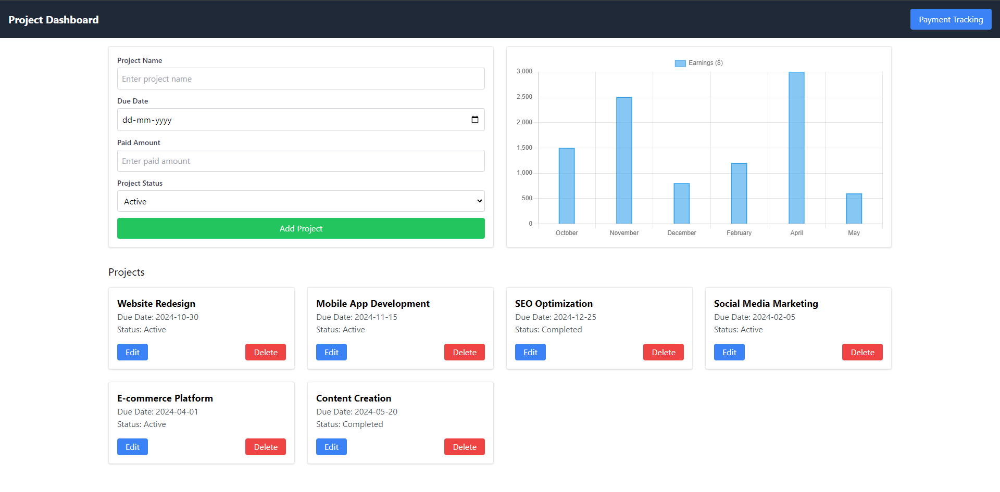
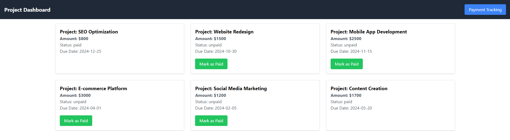

# Project Management - (Create React App)

This is a simple project management application that allows users to add, track, and manage projects. Each project is associated with a payment, and users can track project status and payments, mark payments as "Paid," and visualize earnings using a dynamic chart. The application is built using React and includes localStorage for persistent data storage. this website is available on : https://project-management-gamma-two.vercel.app/




## Features
- Add New Projects: Users can add new projects with details like project name, due date, status, and payment amount.
- Payment Tracking: Each project is associated with a payment record, which starts with a default "Unpaid" status and an amount. Users can mark payments as "Paid."
- Earnings Chart: The application dynamically displays a bar chart of monthly earnings based on project payments. If multiple projects are due in the same month, their amounts are combined.
- Project Management: Users can view a list of projects and delete projects as needed. Deleting a project prompts the user with a confirmation modal.
- Responsive UI: The layout is fully responsive, ensuring an optimal experience across all screen sizes.
- LocalStorage: Projects and their associated data are saved in the browser's localStorage, allowing the user to persist data even after refreshing the page.


## Getting Started

- Clone the repository.
```
git clone https://github.com/your-username/project-management.git
```

- Install the dependencies.
```
npm install
```

- Start the development server.
```
npm start
```
- Open your browser and go to http://localhost:3000 to see the application in action.